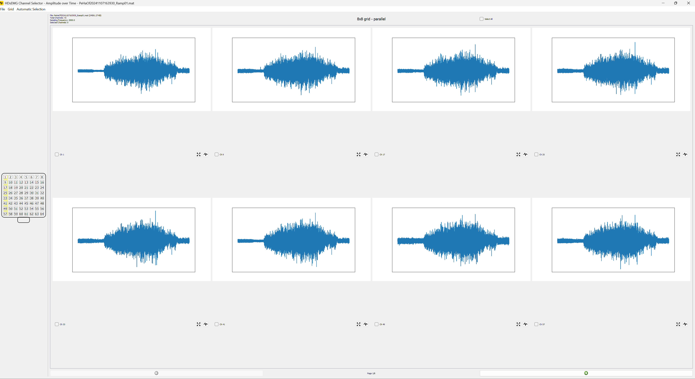
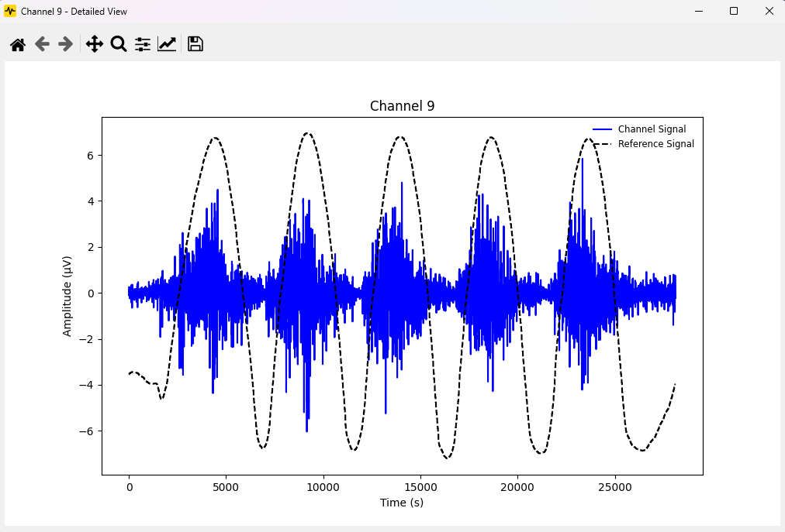
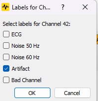
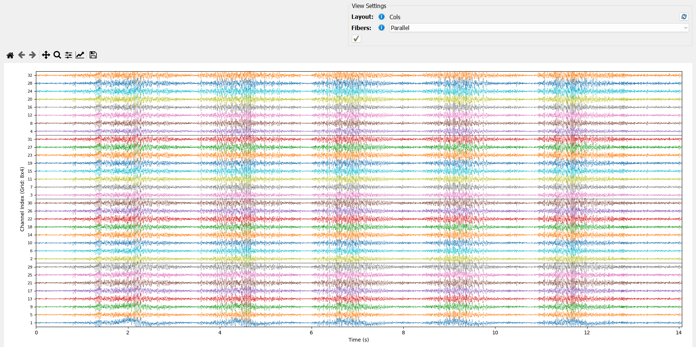

<div align="center">
<br>
  <br>
    <h2 align="center">🧼 hdsemg-select 🧼</h2>
    <h3 align="center">HDsEMG data cleaning tool</h3>
</div>

---

A graphical user interface (GUI) application for selecting and analyzing HDsEMG channels from `.mat` files. This tool
helps identify and exclude faulty channels (e.g., due to electrode misplacement or corrosion) and **automatically flag potential artifacts like ECG contamination, power line noise (50/60Hz), or general signal anomalies**. This enables more accurate and efficient analysis by providing suggestions for channels or segments needing review.

---

## Table of Contents

- [Features](#features)
- [Screenshots](#screenshots)
- [Installation](#installation)
- [Usage](#usage)
- [File Format](#file-format)
- [Requirements](#requirements)
- [Contributing](#contributing)

---

## Features

- ✅ Load `.mat` files and visualize multi-channel HDsEMG signals.
- 🧠 Automatic detection of grid size via inter-electrode distance.
- ✏️ Manual grid configuration when automatic detection fails.
- 🔄 Switch between grid orientations (parallel/perpendicular to muscle fibers).
- 🖼 Grid and signal visualization:
    - Electrode Widget with numbered and selectable channels.
    - Overview with page navigation and signal thumbnails.
    - Detailed viewer with time-domain and frequency spectrum plots.
    - Get the reference signal from the specific grid as an overlay in the dashboard view.
- ✅ Manual and automatic channel selection.
    - 📈 Amplitude-based selection with configurable thresholds.
- ⚡️ **Automatic Artifact Flagging:** Identify potential ECG contamination, power line noise (50Hz/60Hz), or general artifacts based on configurable thresholds (Frequency Threshold, Variance Threshold, Frequency Band). Suggested flags are added as channel labels.
    - Ability to add custom labels in settings and apply them to channels.
- 📊 Frequency-based analysis (planned).
- 💾 Save selections and **artifact flags** in structured `.json` files and automatically generate cleaned `.mat` files (excluding selected/flagged channels if desired).
- 🖥 Dashboard with file metadata: filename, number of channels, sampling rate, size, selection count.
- ⏱ Efficient loading with warnings and abort option for large data.
- 🔍 Analyse the action potential propagation of the selected grid and apply the orientation (row/col) to grid position relative to muscle fibers.

---

## Screenshots

### Dashboard

_Overview of the application dashboard with loaded file metadata._

### Electrode Widget

_Visualize location of channels on the electrode grid._

### Detail Viewer

_Detailed view of a single channel's time-domain signal._

### Frequency Spectrum

_Analyze the frequency content of a selected channel._

### Channel Labels / Flags

_Dialog to add/remove Channel Labels._

### Signal Overview Plot

_Overview of all channels plotted underneath each other to inspect action potentials (amplitude normalized)._

---

## Installation

1. **Clone the repository:**
   ```bash
   git clone https://github.com/johanneskasser/hdsemg-select.git
   cd hdsemg-select

2. **Create a virtual environment !run commandline as admin! (optional but recommended):**
   ```bash
   # if you prefer python venv
   python -m venv venv
   source venv/bin/activate  # On Windows use venv\Scripts\activate
   pip install -r requirements.txt
   ```
    **or**
    ```bash
    # if you prefer conda
   conda env create -f environment.yml
   conda activate hdsemg-select
    ```

3. **Compile the resource file:**
    ```bash
    cd ./src
    pyrcc5 resources.qrc -o resources_rc.py
    ```

5. **Run the application:**
   ```bash
   python main.py
   ```

---

## Usage

### Load a File

- Click **"File" -> "Open..."** and select a `.mat` file.
- The app attempts to auto-detect the grid based on inter-electrode distance.
- Alternatively, configure the grid manually.

### Navigate and Visualize

- Channels are shown in pages for performance.
- Use **Next/Previous** buttons to navigate pages.
- Click the **eye icon** for a detailed channel view (amplitude + frequency).

### Select Channels

- Mark individual channels as "good" using checkboxes.
- Use **Select All** from the "Automatic Selection" menu to toggle all channels.
- Automatic selection available (Amplitude-based) from the "Automatic Selection" -> "Amplitude Based" menu.

### Automatic Artifact Flagging

1.  **Configure Settings:** Go to **"File" -> "Settings"**. In the Settings dialog, select the **"Automatic Channel Flagging Settings"** tab. Adjust the thresholds and checks (e.g., for 50Hz/60Hz noise) according to your data characteristics and click **"OK"** to save.
2.  **Run Flagger:** After loading a `.mat` file, go to the **"Automatic Selection"** menu and click **"Suggest Artifact Flags..."**.
3.  The application will process the channels based on your saved settings and add suggested flags (like "ECG", "Noise", "Artifact") as labels to the corresponding channels.
4.  Review the suggested flags on the channel widgets and in the detailed view. You can manually edit or remove these labels if needed.

### Save Selection and Flags

- Click **"File" -> "Save Selection"** to export your current channel selection status and any associated labels/flags to `.json` and generate a cleaned `.mat` file.

---

## File Format

A saved `.json` file includes the overall selection status and detailed information for each channel, including any assigned labels:

```json
{
  "filename": "example.mat",
  "layout": {
        "layout_mapping": {
            "parallel": "cols",
            "perpendicular": "rows"
        },
        "set_by_user": "False" // indicates if the grid was set by the user or auto-detected
    },
  "total_channels_summary": [
    {
      "channel_index": 0,
      "channel_number": 1,
      "selected": true,
      "description": "Grid1_1x1",
      "labels": []
    },
     {
      "channel_index": 1,
      "channel_number": 2,
      "selected": false,
      "description": "Grid1_1x2",
      "labels": ["ECG", "Artifact"]
    },
    {
      "channel_index": 15,
      "channel_number": 16,
      "selected": true,
      "description": "Grid1_4x4",
      "labels": ["Noise_60Hz"]
    }
    ...
  ],
  "grids": [
    {
      "grid_key": "Grid1",
      "rows": 4,
      "columns": 4,
      "inter_electrode_distance_mm": 10,
      "channels": [
        {
          "channel_index": 0,
          "channel_number": 1,
          "selected": true,
          "description": "Grid1_1x1",
          "labels": []
        },
        {
          "channel_index": 1,
          "channel_number": 2,
          "selected": false,
          "description": "Grid1_1x2",
          "labels": ["ECG", "Artifact"]
        },
        ...
      ]
    }
    ...
  ]
}
```
*(Note: Added `total_channels_summary` based on your `save_selection_to_json` code, and updated the `channels` structure within `grids` to match)*

---

## Requirements

- Python 3.8+
- Dependencies listed in `requirements.txt`
- Tested on: Linux and Windows 11

---

## 🔗 Related Tools

- [hdsemg-pipe App 🧼](https://github.com/johanneskasser/hdsemg-pipe.git)
- [openhdemg 🧬](https://github.com/GiacomoValliPhD/openhdemg)

---

## Contributing

Pull requests are welcome! If you find a bug or want to suggest a feature, feel free
to [open an issue](https://github.com/haripen/Neuromechanics_FHCW/issues).

---
