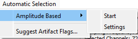
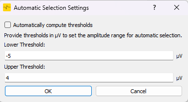
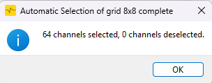

## Automatic Selection

This section describes how to use the automatic selection feature in the hdsemg-select application to quickly identify and identify bad channels based on their signal characteristics.

### Purpose of Automatic Selection

The automatic selection feature is designed to help users quickly identify channels that may be faulty and might disort further Analysis Steps. This is particularly useful in HDsEMG data, where manual inspection of each channel can be time-consuming and impractical.#

### How to Use Automatic Selection

Two methods deselect channels automatically: **Amplitude Based** selection keeps channels inside an amplitude range, and **SNR-based selection** flags channels with spike artifacts.

#### Frequency-Based Selection

| Step | Description                                                                                                                                                                                                                                                                                                                                 | Image                                                                                    |
|------|---------------------------------------------------------------------------------------------------------------------------------------------------------------------------------------------------------------------------------------------------------------------------------------------------------------------------------------------|------------------------------------------------------------------------------------------|
| 1    | Open the **"Automatic Selection"** menu from the top navigation bar.                                                                                                                                                                                                                                                                        |          |
| 2    | Choose **"Amplitude Based Selection"** from the dropdown menu.                                                                                                                                                                                                                                                                              |                                                                                          |
| 3    | In the submenu, you’ll find two options:   - **Start**: Begins the selection process (only enabled if thresholds are set).   - **Settings**: Opens the configuration dialog for amplitude thresholds.                                                                                                                                 |                                                                                          |
| 4    | In the settings dialog, configure:   - **Low Threshold**: Minimum amplitude a channel must exceed.   - **High Threshold**: Maximum allowed amplitude.    **Note:** Enable the "Automatically compute thresholds" checkbox to auto-set thresholds at 75% of the mean minimum/maximum amplitudes across all channels in the grid. |               |
| 5    | Click **"Start"** to begin analyzing channels based on your thresholds.                                                                                                                                                                                                                                                                     |                                                                                          |
| 6    | The application will scan all channels and automatically select those that meet the defined amplitude range.                                                                                                                                                                                                                                |                                                                                          |
| 7    | Once completed, a dialog will summarize the results, showing how many channels were selected.                                                                                                                                                                                                                                               |  |

#### SNR-Based Selection

Flags channels whose peaks stand far above the rest of the grid, deselects them and adds the **Artifact** label. The labels are written to the JSON sidecar on save like any other flag (see [Application Output](application_output.md)).

| Step | Description |
|------|-------------|
| 1 | Open **Automatic Selection → SNR-based selection...** (enabled after a file is loaded). |
| 2 | Choose the **Detection Method**:   - **Global amplitude spike**: a channel is flagged when its peak exceeds N × the median peak of all channels in the grid. Works for any recording.   - **Rest-period spike**: the rest periods are found from the smoothed rectified envelope; a channel is flagged when its peak during rest exceeds N × the global noise floor (median rest RMS across channels). Needs a clear quiet period; without one it falls back to the global amplitude method. |
| 3 | Set the **Factor N** (1.5 to 50). Lower values flag more channels, higher values only extreme outliers. The preview lists the channels that would be flagged. |
| 4 | Tick **Apply to all grids** to run on every grid, otherwise only the current grid is checked. |
| 5 | Run. A summary shows how many channels were flagged per grid. |

The analysis uses the crop range if one is set (see [Crop Signal](crop_signal.md)).
