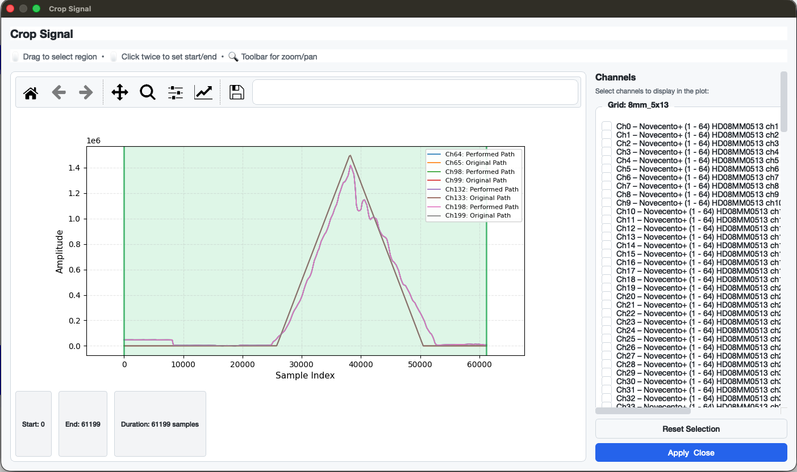

## Crop Signal

The **Crop Signal** feature allows you to interactively select a time range and restrict all views in the application to that region. The crop is **reversible** — it only takes effect permanently when you save the file.

---

## Opening the Dialog

Go to **Signal → Crop Signal…** or press `Ctrl + R`.

> The menu item is only enabled after a file has been loaded.

---

## Selecting a Crop Region

Two interaction modes are available:

| Mode | How to use |
|------|------------|
| **Drag** | Click and drag horizontally on the plot to select a region. |
| **Two-click** | Click once to set the start point (shown as a dashed blue line), then click again to confirm the end. |

The **ROI info bar** below the plot shows the current start sample, end sample, and duration in samples.

- The selection is automatically clamped to the signal boundaries — you cannot select beyond the first or last sample.
- Making a new selection replaces the previous one.

---

## Choosing Which Channels to Display

The sidebar on the right lists all channels, grouped by grid (one section per grid). Check or uncheck channels to control which signals are shown in the plot. This does **not** affect which channels are cropped — the crop always applies to the full recording.

By default, reference channels relevant to the currently selected path are pre-checked.

---

## Buttons

| Button | Action |
|--------|--------|
| **Reset Selection** | Resets the crop region to the full signal length. |
| **Apply & Close** | Stores the selected crop range and closes the dialog. All in-app plots will immediately reflect the cropped view. |

---

## Effect on the Application

Once a crop is applied, the following views use only the cropped time range:

- Main channel grid (signal plots per channel)
- Reference signal overlay
- Signal Overview Plot

The crop remains active for the entire session. To remove it, reopen the dialog and click **Reset Selection → Apply & Close**.

---

## Saving with a Crop

When you save (**File → Save Selection** or `Ctrl + S`) while a crop is active, the crop is applied **permanently** to the output `.mat` file:

- `emg_file.data` is trimmed to `data[start:end+1]`
- `emg_file.time` is trimmed accordingly

After saving, the crop is cleared from the session (the in-memory data now reflects the permanently cropped recording).

---

## Summary

| Feature | Description |
|---------|-------------|
| Access | Signal → Crop Signal… / `Ctrl + R` |
| Selection modes | Drag or two-click |
| Reversible | Yes — until the file is saved |
| Scope | Applies to all in-app plots |
| Permanent | Applied to `.mat` on save |
