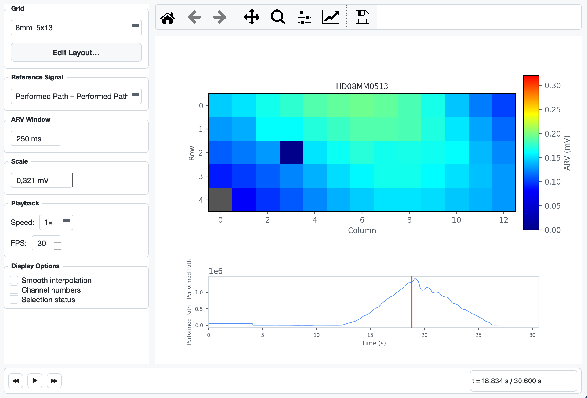

## Density Map

The **Density Map** shows how EMG intensity is distributed across the physical electrode grid over time. Each cell in the grid is coloured by its **Average Rectified Value (ARV)**, using a dark-blue (0) → cyan → yellow → red (max) colour scale. A reference signal plot below the heatmap doubles as an interactive scrubber — you can play the recording and watch the activation pattern evolve.



---

## Opening the Dialog

Go to **Signal → Density Map…** or press `Ctrl + D`.

> The menu item is only enabled after a file has been loaded and a grid has been configured.

---

## Layout

The dialog is split into a **sidebar** on the left and a **plot area** on the right.

### Plot area

| Element | Description |
|---------|-------------|
| **Heatmap** | ARV per electrode cell. Grey cells indicate physically empty positions (connector pin, no electrode). The colour scale is shown in the vertical bar on the right (unit: mV). |
| **Reference signal** | Full-recording overview of the selected reference/aux channel. Acts as a scrubber — click or drag to seek. |
| **Cursor line** | Red vertical line in the reference signal plot marking the current playback position. |

### Sidebar controls

| Control | Description |
|---------|-------------|
| **Grid** | Select which electrode grid to display when the file contains multiple grids. |
| **Edit Layout…** | Opens the custom layout builder for electrode models not yet recognised by the application (see [Custom Layouts](#custom-layouts)). |
| **Reference Signal** | Choose which aux/reference channel to display below the heatmap. Performed Path and Requested Path channels are listed first when present. |
| **ARV Window** | Width of the centred time window used to compute the ARV at the current cursor position (10 – 2000 ms, default 250 ms). Larger values smooth out transient bursts; smaller values show faster changes. |
| **Scale** | Upper bound of the colour scale in mV. Automatically set to the 99.5th-percentile absolute amplitude of the selected grid's channels when a grid is (re-)loaded. Adjust manually if the colours are washed out or too dark. |
| **Playback – Speed** | Playback multiplier: 0.5×, 1×, 2×, 4×. |
| **Playback – FPS** | Timer rate for animation frames (10 – 60 fps, default 30). |
| **Smooth interpolation** | Toggles between nearest-neighbour (crisp cell borders, default) and bilinear (smoothed) rendering of the heatmap. |
| **Channel numbers** | Overlays the 1-based channel number on each electrode cell. |
| **Selection status** | Overlays a green (selected) or red (deselected) tint on each cell. Clicking a cell in the heatmap toggles that channel's selection status, identical to clicking the checkbox in the main window. |

---

## Playback

### Transport bar

The bar at the bottom of the dialog contains three buttons:

| Button | Shortcut | Action |
|--------|----------|--------|
| ⏪ | — | Seek backward 2 s |
| ▶ / ⏸ | — | Play / Pause |
| ⏩ | — | Seek forward 2 s |

The time label on the right (`t = X.XXX s / Y.YYY s`) always shows the current cursor position and the total recording length.

### Scrubbing via the reference signal

Click anywhere on the reference signal plot to jump to that time. Hold and drag left or right to scrub continuously. The heatmap updates on every drag step.

> Pan and zoom on the reference plot (via the matplotlib toolbar) is supported. While the toolbar's pan or zoom mode is active, click and drag navigate the view instead of seeking.

---

## ARV computation

For every displayed frame the ARV is computed as:

```
arv[ch] = mean( |data[center − w/2 : center + w/2, ch]| )
```

where `center` is the current sample and `w` is the ARV window in samples. The window is clamped to the recording boundaries. The result is then mapped from channel indices to grid positions using the physical electrode layout.

---

## Custom Layouts

If the application does not recognise the electrode model (the plot shows *"No physical layout found for …"*), click **Edit Layout…** in the sidebar. The builder lets you:

1. Set the number of rows and columns with the spin boxes.
2. Assign a channel number (1-based) to each cell using the dropdown per cell. Leave cells set to *(empty)* for physically absent electrodes.
3. Click **OK** to save. The layout is persisted in the application config and reloaded automatically on future sessions.

---

## Interaction with the rest of the application

- **Grid change** (main window): the density map dialog is invalidated and must be reopened.
- **Crop**: if a crop is applied while the dialog is open and playback is running, the data reference changes on the next timer tick; the cursor resets to 0 and the reference signal redraws to show only the cropped range.
- **Channel selection**: toggling a cell via the *Selection status* overlay calls the same handler as the main-window channel checkboxes — the selected-channel count label and electrode overview update immediately.

---

## Summary

| Feature | Detail |
|---------|--------|
| Access | Signal → Density Map… / `Ctrl + D` |
| Colour scale | Dark blue (0 mV) → cyan → yellow → red (max mV) |
| ARV window | Centred, 10 – 2000 ms, default 250 ms |
| Scrubbing | Click or drag on the reference signal plot |
| Playback speeds | 0.5×, 1×, 2×, 4× |
| Display overlays | Smooth interpolation, channel numbers, selection status |
| Custom layouts | Persisted per electrode model via the layout builder |
