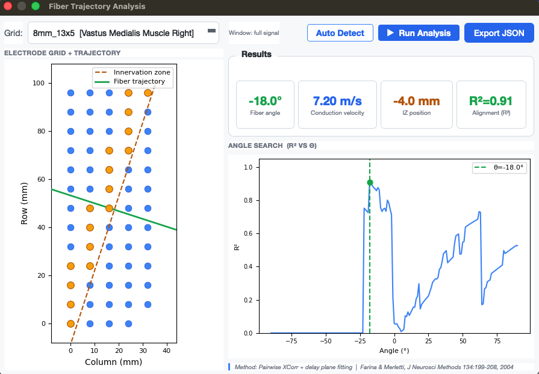
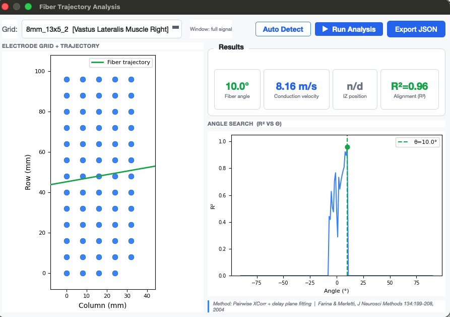
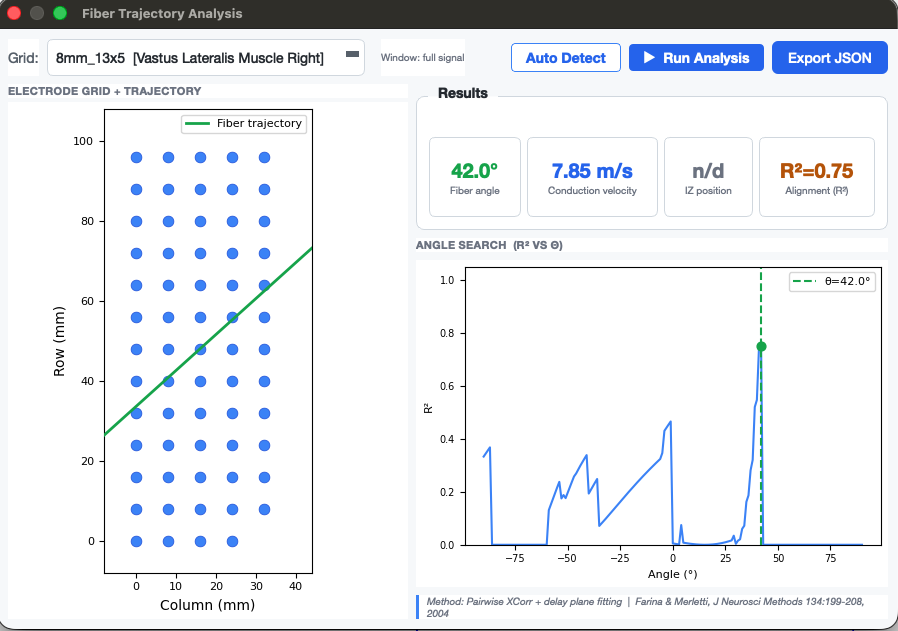

## Fiber Trajectory Analysis

The **Fiber Trajectory Analysis** estimates, for one grid, the direction in which motor unit action potentials travel across the electrodes. From that direction it reports the fiber angle relative to the grid, the conduction velocity and, if one lies under the grid, the position of the innervation zone. Use it to check whether a grid was placed along the fibers, or to find out why a grid yields few motor units.

---

## Opening the Dialog

Go to **Signal → Fiber Trajectory Analysis...**

> The menu item is only enabled after a file has been loaded and a grid has been configured.

---

## Controls

| Control | Description |
|---------|-------------|
| **Grid** | The grid to analyse. |
| **Window** | Shows which part of the signal is used: the full signal, or the crop range if one is set (see [Crop Signal](crop_signal.md)). |
| **Run Analysis** | Runs the angle search and fills the result cards and plots. |
| **Auto Detect** | Runs the analysis and suggests a grid orientation: within ±20° the fibers run along the columns, beyond ±70° along the rows. In between the fibers run obliquely and no orientation change is suggested. |
| **Export JSON** | Saves the results (including propagation score, CV status and R²), the score and velocity for every search angle, and the pairwise delays to a JSON file. |

## Results

| Card | Meaning |
|------|---------|
| **Fiber angle** | Angle of the fiber direction, measured from the column axis (0° = parallel to the columns, ±90° = parallel to the rows). |
| **Conduction velocity** | Propagation speed along the fiber direction, in m/s. When an innervation zone splits the grid, only the longer side of it is used, since the potentials travel in opposite directions on either side. `n/d` when too few electrode pairs gave a physiological velocity (2 to 10 m/s); the tooltip shows the status. |
| **IZ position** | Position of the innervation zone along the fiber direction, in mm. `n/d` if no innervation zone lies under the grid, which is normal when the grid covers only one side of it. |
| **Propagation score** | 0 to 1, how consistent the delays between neighbouring electrode positions are along the fiber direction. This is the selection criterion. 0.6 and above is good, 0.3 to 0.6 moderate, below 0.3 means the grid shows no clear propagation. |
| **Alignment (R²)** | Secondary. R² of delay against distance from the first electrode. A low R² next to a high propagation score is the signature of an innervation zone, because the delays form a V instead of a line. |

The left plot shows the electrode grid with the estimated fiber trajectory. If an innervation zone is detected, it is drawn as a dashed line and the electrodes closest to it are highlighted. The right plot shows the propagation score over all search angles; the selected angle is marked.

## Reading the Result

A clear result has one distinct peak in the angle search and a high propagation score:

A low score with several competing peaks means the direction is not well defined. Typical causes are poor signal quality on part of the grid, a grid placed across the fibers, or a window that contains more rest than contraction. Cropping to a clean contraction burst often helps.

---

## Method

The measurement is `hdsemg_shared.quality.propagation.propagation()` from hdsemg-shared. For each candidate direction from -90° to 90°, the electrodes are binned by their position along that direction, and the delay between neighbouring bins is measured by cross-correlating their **single differential**. The monopolar signals share a common component that pulls the correlation peak towards zero delay. The chosen direction is the one whose delays are most consistent in magnitude, weighted by the correlation strength and the share of bin pairs giving a physiological velocity. Because the score ignores the sign of the delays, an innervation zone does not lower it. A linear R² fit collapses in that case. The conduction velocity is the median velocity over the bin pairs, and the innervation zone is found as a sign reversal of the delays. Based on Farina & Merletti, *J Neurosci Methods* 134:199–208, 2004.
