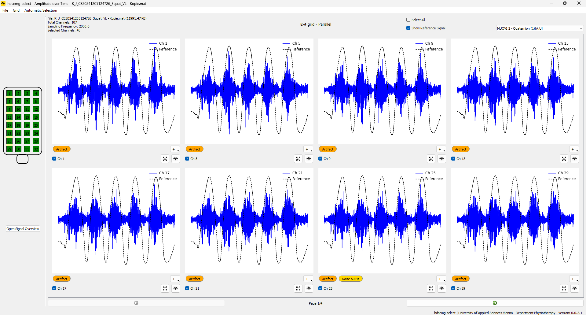

## Getting Started with hdsemg-shared

After following the installation instructions, you can start using the application to inspect and clean your HD-sEMG data. This guide will help you get started with the basic functionalities of the application.

### 1. Launching the Application

To launch the application, run the following command in your terminal or command prompt:

```bash
  python main.py
```

This will open the application where you will be greeted with the dashboard.


### 2. Loading Data

To load your HDsEMG data, follow these steps:

1. Open the explorer by clicking **File** --> **Open...** or by pressing `Ctrl + O`
2. Select the file you want to load. The application supports the following file formats
   1. `.mat` files
   2. `.otb+` files
   3. `.otb4` files
   4. `.otb` files
3. The application will attempt to auto-detect the grid configuration of your data. If it fails, you can manually configure the grid settings.
4. Once the file is loaded, you will see the grid and orientation selection dialog. Here, you can select the grid you want to display and if rows or columns are parallel to the muscle fibers (this depends on your setup). If you dont know, you will be able to examine the action potential propagation in the [Signal Overview Plot](signal_overview_plot.md) and change the orientation afterwards.


6. After selecting grid and orientation, the application will display the dashboard.



Here you can see the loaded data and navigate through the rows/columns of the grid by pressing either the buttons on the bottom or by pressing the left/right arrow keys. 

> To find out what else can be done in the dashboard, please refer to the [Dashboard Guide](dashboard.md).